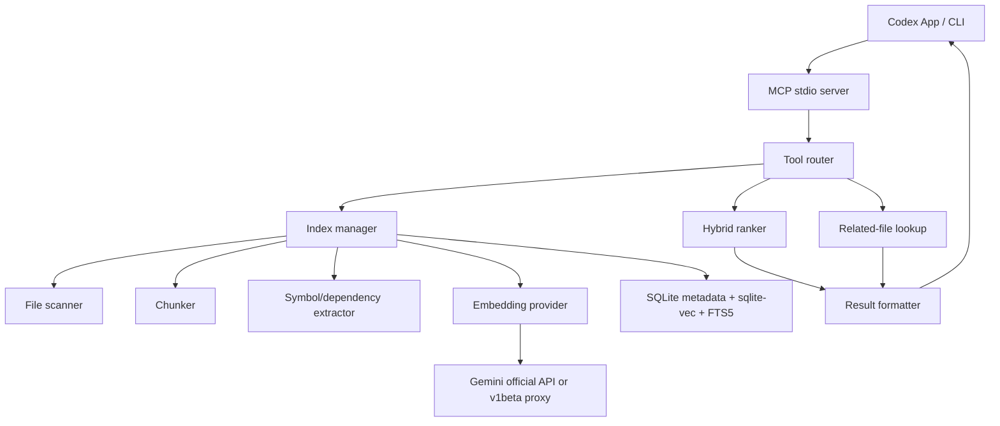

# Repo Beacon MCP 架構設計

## 目標

Repo Beacon MCP 的目標不是複製完整商業版 Augment Context Engine，而是先做一個本機、可控、可接 Codex App 的上下文搜尋層：

1. 對 repo 建立本機索引。
2. 支援自然語言查詢程式碼。
3. 返回可直接給 Codex 使用的檔案路徑、行號範圍、片段與 grep 建議。
4. 支援官方 Gemini Embedding 2 與第三方 v1beta 中轉站。
5. 後續可擴充成 hybrid search、symbol graph、git history 與多 repo context。

## 系統邊界

Repo Beacon 負責：

- 掃描工作區檔案。
- 依語言與結構切 chunk。
- 產生 embedding。
- 儲存本機索引。
- 查詢與排序。
- 透過 MCP tools 回傳上下文。

Codex 負責：

- 決定何時呼叫 MCP tool。
- 根據回傳片段讀取/編輯檔案。
- 執行測試與修改程式碼。

Embedding provider 負責：

- 將 query/chunk 轉成向量。
- 不負責保存程式碼。
- 不負責判斷搜尋結果。

## 高階流程



## 模組分層

### MCP Layer

位置：`src/index.ts`, `src/tools/registerTools.ts`

職責：

- 啟動 stdio MCP server。
- 註冊工具。
- 保持工具輸入 schema 穩定。
- 將內部錯誤轉成可讀的 tool response。

初期 tools：

- `repo_index_status`
- `gemini_embedding_probe`
- `repo_reindex`
- `repo_semantic_search`
- `repo_related_files`

後續 tools：

- `repo_open_ranges`
- `repo_grep_suggest`

### Config Layer

位置：`src/config.ts`

職責：

- 從環境變數讀取 provider 與索引設定。
- 支援官方 Gemini 與中轉站差異。
- 不讀取密鑰到 log 或回傳內容，只回傳 `hasApiKey`。

### Embedding Provider Layer

位置：`src/providers/*`

目前 provider：

- `GeminiEmbeddingProvider`

設計原則：

- 使用 REST，不綁定 Google SDK，方便中轉站相容。
- provider 介面只暴露 `embed` / `embedBatch`。
- query/document formatting 在 provider 內處理，避免上層漏掉 Gemini Embedding 2 的 task prefix。

### Index Manager

職責：

- 判斷索引是否過期。
- 比對檔案 hash。
- 增量更新 chunk 和 vector。
- 控制 batch embedding。
- 控制併發與 rate limit。
- 每次 reindex 重建單檔 symbol/dependency metadata。
- 對未變更 chunks 保留 row id，避免重算 embeddings。

### File Scanner

候選規則：

- 尊重 `.gitignore`。
- 內建排除：`.git`, `node_modules`, `dist`, `build`, `.next`, `coverage`, binary files。
- 預設只索引可讀文字檔。
- 可用 allow/deny glob 擴充。

### Chunker

初期策略：

- 通用文字 chunk：依行數與 token 粗估切分。
- 每 chunk 保留 `path`, `startLine`, `endLine`, `language`, `hash`, `text`。
- chunk 大小目標：300-900 tokens。
- 相鄰 chunk overlap：30-80 tokens。

進階策略：

- tree-sitter 依 function/class/module 切分。
- 對大型檔案建立 summary chunk。
- 記錄 imports/exports/symbols。

### Symbol Graph

目前採用輕量 regex extractor，抽取常見 TS/JS/Python/Go/Rust 的 declarations 與 imports：

- `file_symbols`: name、kind、line、signature、exported。
- `file_dependencies`: raw specifier、resolved relative path、line。

這層刻意獨立於 chunk/embedding storage，升級 extractor 或之後換成 tree-sitter 時，不會破壞既有 embedding cache。查詢上先提供 `repo_related_files`，讓 Codex 在搜尋命中後按需展開 imports / reverse imports，而不是每次搜尋都塞入大量相關檔案。

### Storage Layer

MVP 儲存選型：

- metadata: SQLite
- vector: sqlite-vec
- keyword: SQLite FTS5 + rg fallback

不建議先用 JSON vector 當正式 MVP。1536 維向量若用 JSON 存放，索引體積、解析成本與相似度掃描成本都會太早變成瓶頸。可以在單元測試中保留 in-memory vector store，但實際索引從 Phase 2 開始使用 sqlite-vec。

資料表草案：

```sql
files(
  id integer primary key,
  project_path text not null,
  path text not null,
  mtime_ms integer not null,
  size integer not null,
  hash text not null,
  unique(project_path, path)
);

embedding_sets(
  id integer primary key,
  provider text not null,
  base_url_hash text not null,
  model text not null,
  dimensions integer not null,
  created_at text not null,
  unique(provider, base_url_hash, model, dimensions)
);

chunks(
  id integer primary key,
  file_id integer not null,
  start_line integer not null,
  end_line integer not null,
  language text,
  title text,
  text text not null,
  hash text not null,
  unique(file_id, start_line, end_line, hash)
);

embeddings(
  chunk_id integer not null,
  embedding_set_id integer not null,
  primary key(chunk_id, embedding_set_id)
);

file_symbols(
  id integer primary key,
  file_id integer not null,
  name text not null,
  kind text not null,
  line integer not null,
  signature text not null,
  exported integer not null
);

file_dependencies(
  id integer primary key,
  file_id integer not null,
  specifier text not null,
  resolved_path text,
  line integer not null
);
```

### Ranking Layer

初期 hybrid score：

```text
score = 0.70 * vector_similarity
      + 0.20 * keyword_score
      + 0.05 * path_score
      + 0.05 * recency_or_open_file_boost
```

Codex 使用情境下，結果要比一般 RAG 更偏向「可操作」：

- 返回完整檔案路徑。
- 返回行號範圍。
- 返回短片段。
- 返回為何匹配。
- 返回建議 grep keywords。
- 返回 context budget summary，並在超出 `max_context_chars` 時截斷 snippets。

## 與 Augment / fast-context-mcp 的差異

### 相對 fast-context-mcp

Repo Beacon 會更偏本機索引與可配置 provider，不依賴 Windsurf/Devin key。查詢可以混合 embedding 與 keyword，而不是只靠查詢時推理與 grep。

### 相對 Augment Context Engine

Repo Beacon MVP 不包含：

- 團隊級跨 repo 權限系統。
- 即時 IDE active context。
- 完整 knowledge graph。
- commit/issue/design docs 深度整合。
- 商業級 context compression。

可逐步補：

- git history indexing。
- symbol graph。
- 多 repo workspace。
- docs/tickets connector。

## 安全與隱私

- 索引資料預設存在 repo 內 `.repo-beacon/`。
- 原始程式碼不送到 Codex 以外的地方，除非呼叫 embedding provider。
- 若使用 Gemini Embedding，chunk text 會送到 configured endpoint。
- 若使用第三方中轉站，應視為會看到 query/chunk text。
- 不在 tool output 顯示 API key。
- 對私有或敏感 repo，應提供 `REPO_BEACON_DISABLE_REMOTE_EMBEDDINGS=true` 這類後續開關，避免意外送出 chunk。
